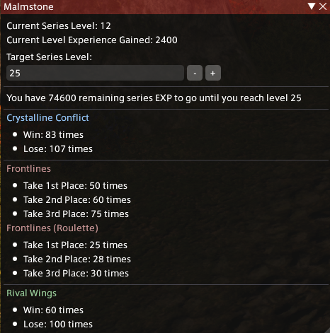
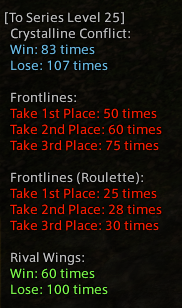

<<<<<<< HEAD
# PVP通行证计算器


一个 Dalamud 插件，用于计算距离目标PVP通行证系列等级还需要打多少场 PVP。
=======
# Malmstone Calculator


A Dalamud plugin that calculates how much more PVP you have to play to reach your target Malmstone Series Level.
>>>>>>> dbffb5c6f99683e459e9a36432a6221c5c4f71f1

```
/pmalm
```
<<<<<<< HEAD
[命令说明](https://github.com/pinapelz/ffxiv-malmstone/wiki/Commands)

如需体验实验性版本，请按照[此处](https://github.com/pinapelz/DalamudPlugins)的指引，将我的自制插件仓库添加到 Dalamud。

<div style="display: flex; justify-content: space-between;">
  
  
</div>

灵感来自 [belthesar 的 MalmstoneXPCalculator](https://github.com/belthesar/MalmstoneXPCalculator)
=======
[Commands](https://github.com/pinapelz/ffxiv-malmstone/wiki/Commands)

For an experimental version, please add my custom plugin repository to Dalamud by following the instructions [here](https://github.com/pinapelz/DalamudPlugins)

<div style="display: flex; justify-content: space-between;">
  
  
</div>

Inspired by [belthesar's MalmstoneXPCalculator](https://github.com/belthesar/MalmstoneXPCalculator)
>>>>>>> dbffb5c6f99683e459e9a36432a6221c5c4f71f1
